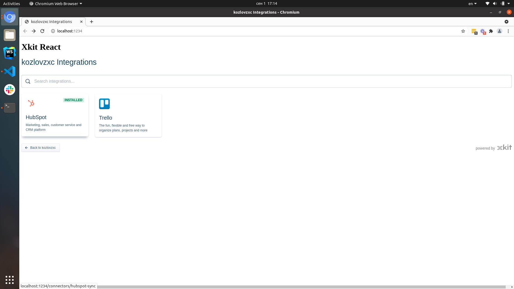

This is an example of how to use the Xkit embedded catalog in React.js. It is using [Parcel](https://parceljs.org/) as a bundler.

### How to use

* Allow your app to make request to the server.
  1. Visit [app.xkit.co/settings](https://app.xkit.co/settings).
  1. Find **Web Origins** section.
  1. Add `http://localhost:1234`.
* Install dependencies `yarn`.
* Open [src/app.tsx](./src/app.tsx) and paste `<your slug>` value. You can find it on the same [app.xkit.co/settings](https://app.xkit.co/settings) page as a `Project Subdomain`.
* Run `yarn dev`.
* Visit [localhost:1234](http://localhost:1234).

If you created any sources before, you will see something like this.

Otherwise you will need to create them on [app.xkit.co/sources](https://app.xkit.co/sources).

### Learn more

To learn more about Xkit, visit the [Xkit docs](https://docs.xkit.co/).

Also there is [xkit-next](https://github.com/xkit-co/xkit-next), which is an example of how to use the Xkit embedded catalog in [Next.js](https://nextjs.org/).